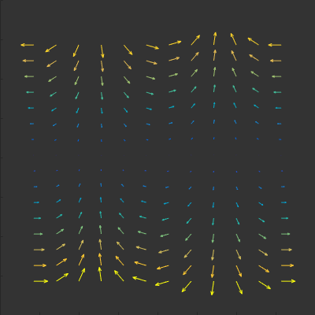

# Color-Quiver
A very fast quiver plot with individual colors per arrow

Works like the normal quiver component, except each arrow can have an individual color. The following modes can be chosen for parameter *CDataMode*:
* **Mag** Color is set according to vector magnitude, mapped to figure colormap
* **Angle** Color is set according to vector direction (x maps to red channel, y to green)
* **Direct** An RGB triplet can be set for each arrow location. That means, the *CData* property has to have size [numel(x) x 3]

More information on syntax can be obtained by entering `doc cquiver`. See the example for a demo and to see how to use the plot.

